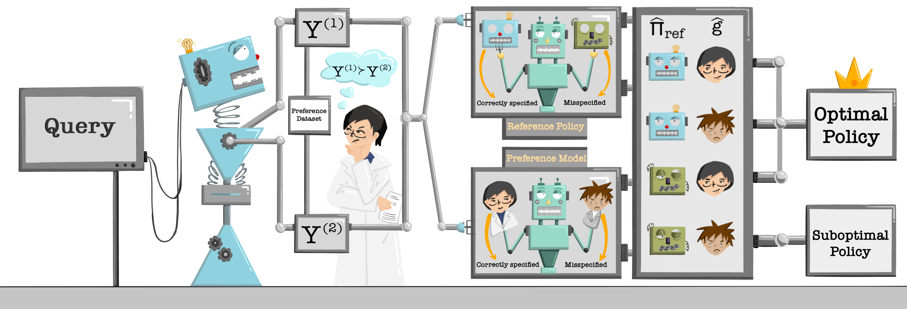

# Double Robust Preference Optimization

This is the codebase for [Doubly Robust Alignment for Large Language Models](www.google.com)




## Quickstart

```bash
git clone https://github.com/DRPO4LLM/Double-Robust-Preference-Optimization.git && cd drpo
pip install -r requirements.txt
```

You need to config your own policy model (reference policy model), auxiliary preference model, your dataset, and other hyperparameters in `config.yaml` or  `drpo.py` before

```bash
python ./examples/{tldr, hh}/drpo.py
```

A typical dataset should be in the form of either

```
dataset = {"prompt": "The sky is",
                      "a1": " blue.",
                      "a2": " green.",
                      "rank": 1,}
```

or 

```
# Conversational format
dataset = {"prompt": [{"role": "user", "content": "What color is the sky?"}],
                      "a1": [{"role": "assistant", "content": "It is blue."}],
                      "a2": [{"role": "assistant", "content": "It is green."}]
                      "rank": 1,}
```
